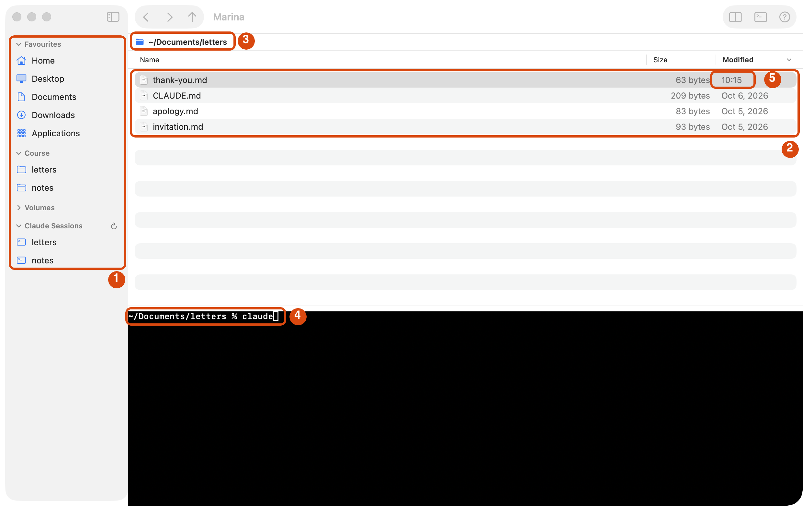
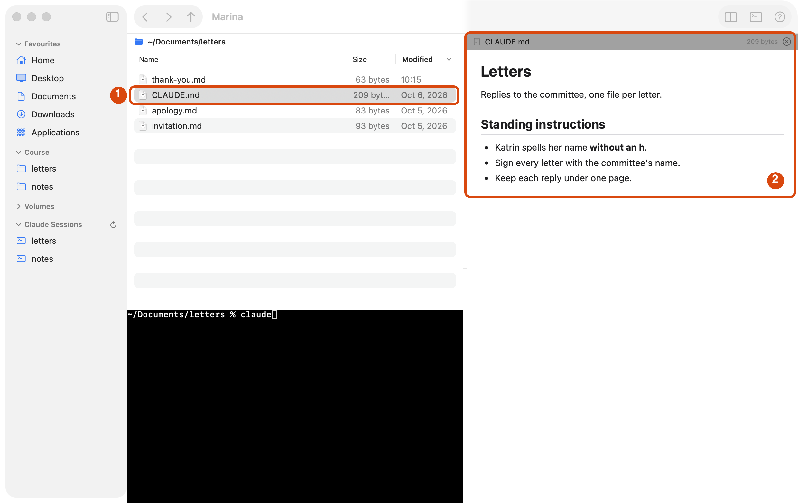
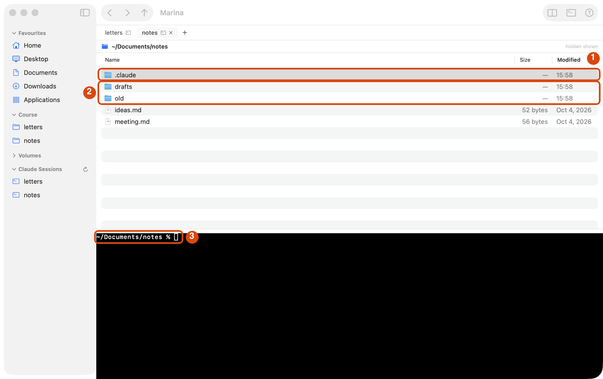
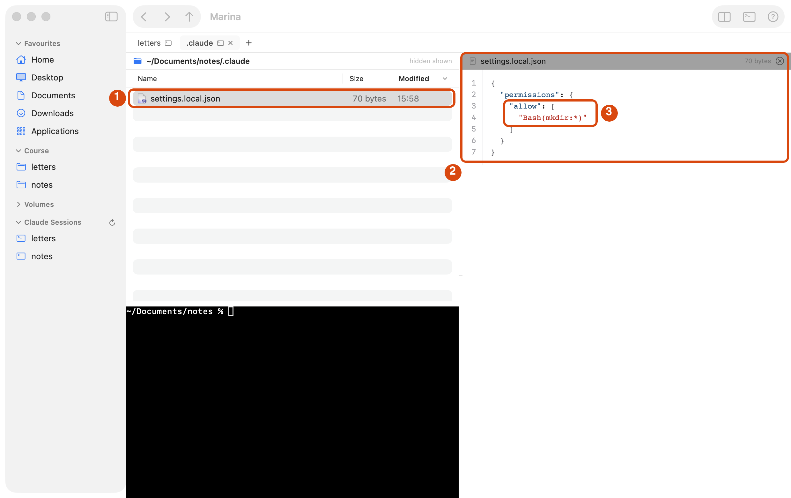
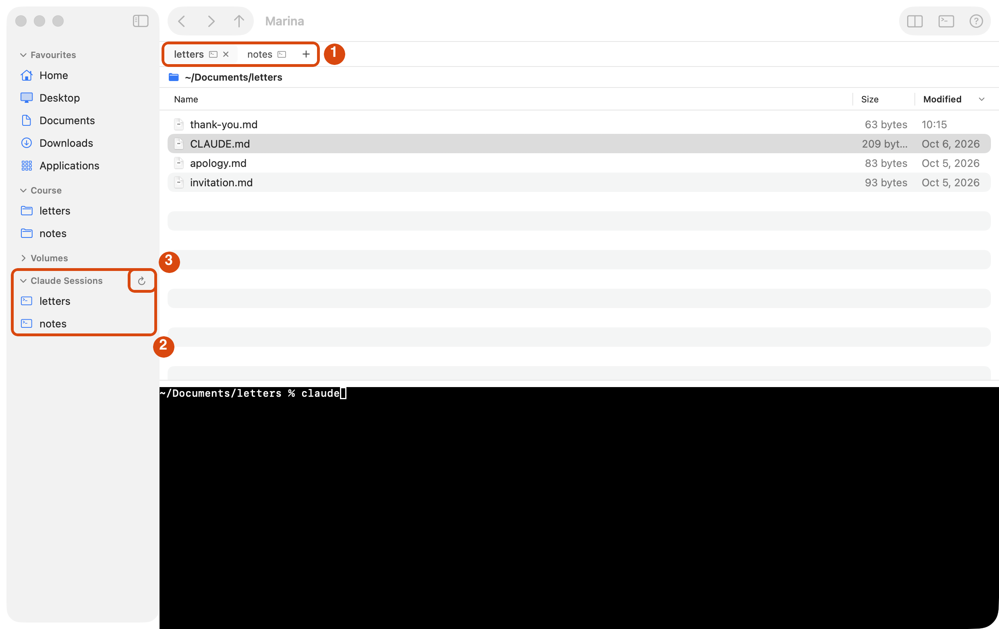

# Marina user guide

Marina is a file manager for the Mac with a terminal built into every tab. This
guide shows what it does for someone who works with AI sessions, one part of
the work at a time. It is written to stand on its own as Marina's user guide,
and to serve as the Marina appendix of the AI sessions course book, which is
why it follows the course's modules M0 to M3 and its words: session, session
folder, context file, settings file, dialog.

**Version.** Everything here is true of **Marina 0.5.0**, and every picture was
taken from that version. The folders in the pictures, `letters` and `notes`,
are the course's own invented examples; nothing in them belongs to a real
person. The pictures show Marina's window while another app is in front, which
is why its text is drawn in macOS's slightly greyed inactive style.

**Getting Marina.** Download the installer (`Marina-0.5.0.pkg`) from the
releases page of [github.com/fherwig/marina](https://github.com/fherwig/marina/releases)
and open it. It installs Marina for you alone, in the Applications folder of
your home folder, and asks for no administrator password. The installer is not
notarised by Apple, so the Mac refuses it on the first try: right-click it,
choose Open, and Open again. On first use Marina asks for access to your
Desktop, Documents and Downloads folders. It is a file manager; say yes.

---

## M0 — Overview: Marina as the lighter access layer

The course uses three access layers. A terminal and Finder are the one everybody
already has: one terminal window per session, and a Finder window beside it on
the session's folder. The session dashboard is the fuller one, for many sessions
kept running while you are elsewhere (M4 on). Marina sits between them: the
lighter access layer for **a few sessions open side by side**.

What Marina adds over a terminal and Finder is that the two are one window, and
that they stay together.

*Figure 1. One session in Marina.* **(1)** The sidebar: places you go often
(here with a section *Course* holding the course's two folders), and at the
bottom a section listing every Claude Code session running on the Mac. **(2)**
The file pane, showing one folder — here the session folder `letters`. **(3)**
The path of that folder. **(4)** The terminal, under the file pane, in the same
folder: this is where the harness runs (here `claude` has been typed and not
yet started). **(5)** The newest file is listed first.

(Click the path at the top of the file pane to copy it, for a `cd` elsewhere.)

The keys that matter for the course:

| Key | What it does |
|---|---|
| ⌘T | A new tab, on the folder you are in. One tab per session. |
| ⌘\` | Show or hide the tab's terminal. It is the key left of 1: ⌘^ on a German keyboard. |
| ⌘3 | The viewer beside the file pane: shows the selected file — markdown rendered, code highlighted. |
| ⇧⌘. | Show or hide hidden files, such as the `.claude` folder. |
| ⌘0 | Go to the sidebar. |
| Space | Quick Look at the selected file. |

---

## M1 — What a session is: one folder, seen from both sides

A session works in one folder, its session folder, and it can see and change
what is in that folder. In Marina a tab holds both sides of that: the
terminal where the session runs, and the file pane showing its folder.

**Starting a session in its folder.** Go to the folder in the file pane — from
the sidebar, or by arrowing to it and pressing →. Press ⌘\` and the terminal
opens *in that folder*: there is no `cd` to type. Type `claude` and press
Return, and the session's folder is the one the file pane shows (Figure 1).

**The two sides stay together.** If you change folder in the terminal (`cd`),
the file pane follows. If you change folder in the file pane while the terminal
sits idle at its prompt, the terminal follows — but never while a program is
running in it, so a session that is working is not interrupted.

**Watching the files a session changes.** The file pane lists the newest
first, with folders grouped above files. A file the session creates, renames
or deletes appears or disappears in the file pane at once, and a new file
arrives at the top of the files. In Figure 1 the
session has just corrected the typo in `thank-you.md`, which is why that letter
is first, with today's time beside it **(5)**. (A file that is edited in place shows
its new date when the folder is next read, for example when you come back to it.)

To read a file without leaving Marina, select it and press Space for Quick
Look, or ⌘3 for the viewer.

---

## M2 — What a session remembers: the context file

The context file is the plain-text file of standing instructions in the session
folder, `CLAUDE.md` for Claude Code, which the harness reads at the start of
every conversation. It is the one of a session's three memory files that is in
the session folder, so Marina's file pane shows it beside your drafts.

*Figure 2. The context file in the viewer.* **(1)** `CLAUDE.md` selected in the
session folder. **(2)** The viewer (⌘3) shows it rendered: headings, lists and
emphasis as they are meant to read. The line about Katrin is the fact from M2's
example, put where every new conversation will find it. Here the terminal sits
under the file pane only (⌥⌘J), so the viewer has the window's full height.

The viewer follows the selection, so you can arrow through a folder and read
each file as you pass it. Markdown is rendered (with mathematics, tables and
code), source code is highlighted by language, and Word documents,
spreadsheets, PDFs and images are shown as themselves.

**Editing the context file.** Select it and press ⌘O to open it in your usual
editor, or ⌥⌘O to choose which application. You can also ask the session to
change it.

**The transcript and memory are elsewhere.** Claude Code keeps them outside the
session folder, under `.claude/projects/` in your home folder, in a folder named
after the session folder. Marina can show them: go to your home folder, press
⇧⌘. to show hidden files, and open `.claude`, then `projects`. Memory notes are
markdown files, which the viewer renders.

---

## M3 — Permissions: the settings file, and the folders a session makes

A session's saved rules live in its settings file, inside a hidden folder in
the session folder. Finder does not show hidden folders; Marina does, on one
key.

*Figure 3. The session folder `notes`, with hidden files shown.* **(1)** ⇧⌘.
has shown the hidden `.claude` folder. **(2)** `drafts` and `old`, the two
folders the session made in M3's example; they appeared in the file pane the
moment each was made. **(3)** The terminal, ready in `notes`.

*Figure 4. The settings file in the viewer.* **(1)** Inside `.claude`, the file
`settings.local.json` selected. **(2)** The viewer shows it, highlighted. **(3)**
The rule saved by answering a dialog with "Yes, and don't ask again": the command
that makes a folder, under `allow`. The exact wording Claude Code writes may
differ from this example.

Marina only shows the file. To change your rules, ask the session, or use
Claude Code's own `/permissions`, so that the change goes through a dialog you
can read.

---

## Several sessions at once: tabs, and the Claude Sessions list

Once you keep more than one session open, give each its own tab: ⌘T opens a
tab on the folder you are in, and each tab has a terminal of its own. The tab
bar appears as soon as there are two tabs. Click a tab to switch to it, or use
⌃⌘→ and ⌃⌘← for the next and previous tab.

*Figure 5. Two sessions side by side.* **(1)** The tab bar: one tab per session,
here `letters` and `notes`. **(2)** The Claude Sessions section of the sidebar:
every Claude Code session running on this Mac, by its folder — including those
running in other terminal programs. Click one to go to its folder. **(3)** The
list is a snapshot: ⟳ in the section's header, or ⇧⌥⌘R, takes a new one.

Two things to know when sessions run inside Marina:

- **Closing a tab ends its session.** If a program is still running in the
  tab's terminal — a session at work — Marina asks first. Closing it ends the
  terminal and everything running in it.
- **Quitting Marina ends the sessions in its terminals.** They belong to
  Marina's window. That is the boundary of the lighter access layer: for
  sessions that keep running after you close the window, and for one page that
  shows them all, the course moves on to the session dashboard in M4.

---

## Where to find more

Marina's [README](../README.md) lists everything Marina does, with the full
keyboard map; inside Marina the same map is under ⌃⌘H. Marina is open source:
[github.com/fherwig/marina](https://github.com/fherwig/marina).
